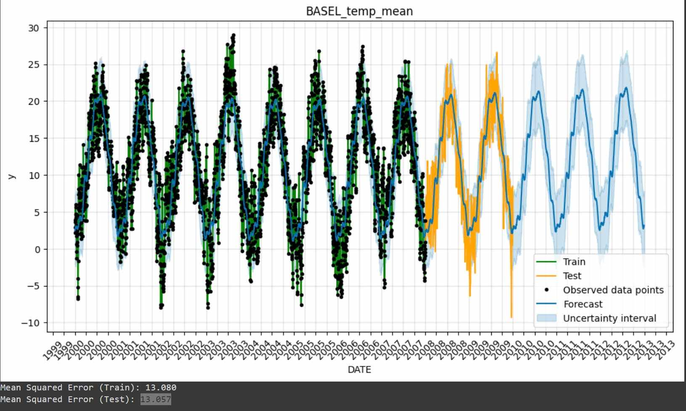

# Weather Forecast
From 10 years of weather data in 18 cities, the AI ​​is trained when:
Enter time, location, and weather component, the output will show the prediction of climate composition at that time.

**[PowerPoint](
https://1drv.ms/p/s!AlVUT5FLwEA7hiteK7omOoKYf8CT?e=ezfKSq)**

## Overview
- Data processing method: Interquartile Range (IQR)
- Approach to the problem (algorithm used):
Model for data processing: Prophet: Open source library developed by Facebook, built on linear models combined with seasonal and event components, making forecasting easier should be easier and more accurate.
- Method of evaluating the problem:
Mean Squared Error (MSE): average of the squares of errors between the predicted value and the actual value.

## Installation
- Clone from github: **[Github](https://github.com/ManhHung110106/Final-Project-Weather-Forecast.git)**
- Python, using pip to install libraries: ***pip install -r requirements.txt***

## Files
- Data: weather_prediction_dataset.csv
- Code: weather_forecast.py
- Python libraries: requirements.txt
## Detailed Description
### Development platform:
- Python: User-friendly, simple, readable syntax, with a strong community of machine learning tools.
- Google Colab: many libraries available, supporting error suggestions. Suitable for sharing with group members simultaneously.
### Methods used:
- Data processing method: Interquartile Range (IQR):
Interquartile range, used to identify and filter outliers values. A value is suspected to be an outlier if it is less than 1.5*IQR below the first quartile $(Q1 - 1.5\times IQR)$ or greater $(1.5 \times IQR)$ above the third quartile $(Q3 + 1.5 \times IQR)$.

&rarr; This method assumes that data outside the upper and lower bounds are outliers
### Approach: Prophet:
- Easy-to-use interface, easy to deploy.
- Weather data is data that changes periodically, &rarr; The tool is suitable for analyzing temporal data with clear seasonality.
### Problem evaluation method: Prophet's MSE:
- Compare MSE of Arima and Prophet:
ARIMA's MSE: Usually smaller when the data is linear, without many obvious nonlinear or seasonal factors.
Prophet's MSE: Usually smaller in cases where the data has a nonlinear trend or clear seasonality.
- Prophet is often superior in more complex situations, while ARIMA may be better for simple time series.
## Conclusion:
- Mean Squared Error on training set: 13,080

 &rarr; the model is already capable of capturing the characteristics of the data during the learning process.
Mean Squared Error on test set: 13,057

 &rarr; Very close to the MSE on the training set,

 &rarr; Shows that the model is not overfitting and has good generalization ability when predicting on new data.

